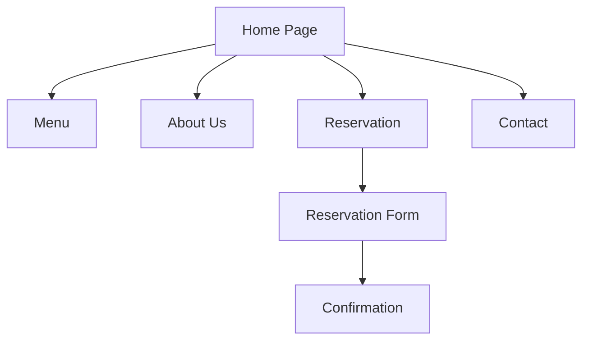

# Matata Restaurant Website

## Project Overview
Matata Restaurant is a modern, responsive website showcasing a restaurant's offerings including menu, about information, reservation system, and contact details. The site provides an elegant digital presence with smooth user experience across devices.

## Features
- Responsive design for all screen sizes
- Interactive navigation menu
- Hero section with call-to-action buttons
- About section with restaurant story
- Featured menu items display
- Customer testimonials
- Reservation booking system
- Contact information

## Technical Stack
- **Frontend**: HTML5, TailwindCSS, JavaScript
- **Fonts**: Google Fonts (Playfair Display, Poppins)
- **Icons**: Heroicons
- **Images**: Unsplash

## User Flow

## Product Requirements (PRD)
### Core Functionalities
1. **Home Page**: Showcases restaurant highlights
2. **Menu Page**: Displays food categories and items
3. **About Page**: Restaurant history and chef information
4. **Reservation**: Online table booking system
5. **Contact**: Location map and contact form

### User Stories
- As a visitor, I want to view the menu to see food options
- As a customer, I want to book a table online
- As a foodie, I want to learn about the restaurant's story

## Minimum Viable Product (MVP)
### Essential Features
- Responsive homepage with key sections
- Functional navigation between pages
- Basic menu display
- Simple reservation form
- Contact information

### Future Enhancements
- Online ordering system
- Customer account management
- Special offers section
- Gallery of restaurant and dishes
